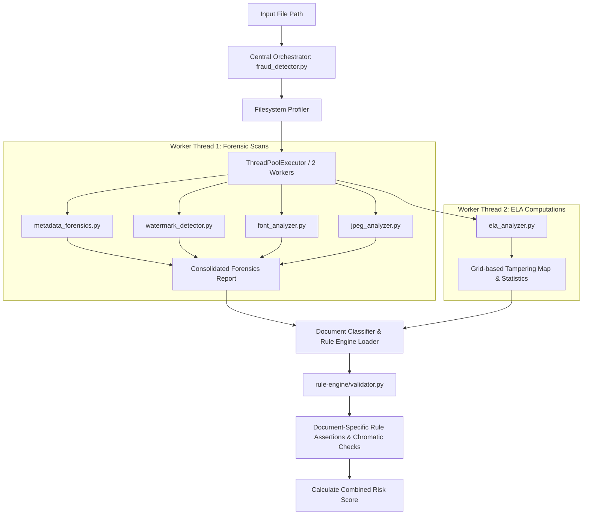

# Unified Document Fraud Detection Engine (The "Brain")

The core forensic analysis engine of the POC is written in Python 3. It utilizes specialized standalone forensic sub-systems to run high-performance filesystem audits, structural metadata extractions, visual AI watermark matching, font baseline alignment calculations, document-specific color profile checking, and pixel-level Error Level Analysis (ELA) to compute a combined risk score.

---

## 🏗️ Architectural Layout

The codebase is organized into a central orchestrator that delegates analysis to decoupled, standalone engines:

```
ocr-fraud-detection-poc/
├── fraud_detector.py        # Central orchestrator integrating all modular analyzers
├── ela_analyzer.py          # Pixel-level Error Level Analysis (ELA) engine
├── metadata_forensics.py    # Deep provenance scanner (EXIF, IPTC, ICC, XMP, C2PA, Stego)
├── watermark_detector.py    # Multi-scale Gemini & DALL-E visual watermark scanner
├── jpeg_analyzer.py         # Double JPEG Grid compression analyzer
├── font_analyzer.py         # Character alignment & font style consistency checks
└── rule-engine/             # Document-specific credential fact-check validators
    ├── base.py              # Parent validator with chromatic color checks
    ├── aadhaar.py           # Aadhaar Verhoeff checksums, DOB checks, font shifts
    ├── pan.py               # PAN status checks, surname matching, DOB checks
    ├── passport.py          # Indian Passport MRZ checksums, validity checks, chronology
    ├── dl.py                # Driving License RTO code extraction, age checks
    ├── gst.py               # GSTIN checksums, PAN extraction, registration dates chronology
    ├── marksheet.py         # Grade report CGPA calculations & subject addition verification
    └── mca.py               # Certificate of Incorporation (CIN) state/year mapping
```

---

## 🧵 Concurrency & Orchestration Flow

To minimize execution latency, `fraud_detector.py` initiates a thread pool using Python's `concurrent.futures.ThreadPoolExecutor` to process analytical tasks concurrently:



---

## 🔍 Forensic Sub-System Details

### 1. Metadata Forensics & Steganography (`metadata_forensics.py`)
Extracts and audits digital provenance signatures across multiple document types:
* **EXIF Parser**: Decodes EXIF tags, checking for fields like `Software` or camera device identifiers (`Make`, `Model`). High-resolution JPEGs completely lacking EXIF headers or missing camera signatures (which indicate screenshots or web exports) are flagged.
* **XMP Extraction**: Scans the raw binary byte stream using regular expressions:
  ```regex
  <x:xmpmeta.*?</x:xmpmeta>
  ```
  It parses the inner XML tree to extract `CreatorTool`, document modification history, and specific software indicators (e.g. Canva creator tools).
* **Steganography Tail Scanner**: Analyzes the physical file structure. It searches for standard End-Of-File markers (e.g., `\xff\xd9` for JPEGs, `%%EOF` for PDFs, `IEND` for PNGs) and flags any bytes trailing these markers as suspicious hidden payloads (`Tail Payload Detected`).
* **Format-Specific Structure**:
  * **PDFs**: Scans binary structures for incremental saves (counting occurrences of `%%EOF`). If `count > 1`, a `PDF_MULTI_REVISION` flag is raised, indicating text or layers are potentially hidden under revisions.
  * **PNGs & GIFs**: Scans chunk frequency blocks to detect anomalies in standard structure.

---

### 2. Visual AI Watermark Matching (`watermark_detector.py`)
Scans the entire image surface for visual patterns generated by AI models:
* **Google Gemini Sparkle**: Matches the four-pointed transparent star emblem:
  1. Performs multi-scale template matching using **Zero-mean Normalized Cross-Correlation (ZNCC)** to eliminate lighting variations:
     $$\gamma(x, y) = \frac{\sum_{x', y'} (T(x', y') - \bar{T})(I(x + x', y + y') - \bar{I}_{x, y})}{\sqrt{\sum_{x', y'} (T(x', y') - \bar{T})^2 \sum_{x', y'} (I(x + x', y + y') - \bar{I}_{x, y})^2}}$$
  2. **Local Contrast Filtering**: Transparent watermarks have low amplitude differences compared to text. The engine calculates the local intensity range (max gray - min gray) in the matched patch. Patches exceeding a contrast threshold of $60.0$ are flagged as false positives (e.g., dark handwritten loops/signatures), whereas patches with contrast $< 60.0$ are validated as genuine semi-transparent watermarks.
* **OpenAI DALL-E Checker**: Detects the 5-color block pattern in HSV space:
  1. Computes Hue, Saturation, and Value thresholds matching DALL-E's custom color palette (Yellow, Turquoise, Magenta, Orange, Blue).
  2. Sorts the centroids of matched color contours horizontally.
  3. Validates the sequence layout: the 5 blocks must be aligned horizontally within $6\text{ px}$ vertically and spaced sequentially within $25\text{ px}$ horizontally.

---

### 3. Pixel-Level Error Level Analysis (`ela_analyzer.py`)
Identifies localized changes by resaving the image at a known quality and comparing pixel variances:
* **Physics & Math**: Repeatedly compressing a JPEG causes pixel deviations to decay toward a stable minimum. Spliced or modified areas are compressed for the first time, exhibiting a much higher error level:
  $$\text{Difference}(x, y) = |\text{Original}(x, y) - \text{Compressed}_{Q90}(x, y)|$$
* **Grid population analysis**: Segments the amplified difference map into a $30\times30$ grid (900 blocks) and computes the mean luminance error $\mu_b$ for each block. A block is flagged as an anomaly if its error exceeds standard thresholds:
  $$\mu_b - \mu_{\text{global}} > 3.5 \times \sigma_{\text{global}} \quad \text{and} \quad \mu_b > 0.8$$
* **Tampering score**:
  $$\text{Score} = \text{Anomalies Penalty} + \text{Variance Penalty} + \text{Peak-to-Mean Ratio} + \text{Max Anomaly Severity}$$

---

### 4. Font Consistency & Text Alignment (`font_analyzer.py`)
Analyzes OCR-extracted characters to verify structural text layouts:
* **Baseline Alignment shifts**: Calculates the bounding box coordinates of characters on each line. It measures vertical offsets from the median line baseline. Characters shifting beyond $5\text{ px}$ are flagged as misaligned, indicating cut-and-paste modifications.
* **Font Profiles**: Audits layout consistency to ensure no font family or font size modifications exist between words in the same text lines.

---

### 5. Rule Engine & Chromatic Profiles (`rule-engine/`)
Performs document-specific semantic fact-checking and color validation rules:
* **Aadhaar (`aadhaar.py`)**: Runs Verhoeff checksum algorithm on 12-digit numbers.
* **Passport (`passport.py`)**: Calculates MRZ checksum fields, age checks, and verifies that the validity period matches standard templates (Adult = 10 years, Minor = 5 years).
* **GSTIN (`gst.py`)**: Validates GST format, extracts and matches the embedded PAN, and checks chronology.
* **MCA (`mca.py`)**: Decodes the Corporate Identification Number (CIN) and matches the state code and year of incorporation against the certificate body.
* **Document Chromatic Color Profiles (`base.py`)**:
  * **Grayscale Copy Detection**: If the average saturation channel ($S$) in HSV space is $< 12.0$, the document is flagged as `DOCUMENT_IS_GRAYSCALE`.
  * **Color Guideline Checks**: Uses HSV color masks to calculate the percentage of expected pixels:
    
    | Document Type | Target HSV Ranges (H, S, V) | Min Threshold | Description |
    | :--- | :--- | :---: | :--- |
    | **Aadhaar** | Teal Background: `[75, 15, 100]` to `[105, 200, 255]` <br> Red Logo: `[0, 40, 80]` to `[10, 255, 255]` | Teal: $\ge 1\%$ <br> Red: $\ge 0.05\%$ | Verifies official background tint and red emblem colors. |
    | **PAN Card** | Teal Background: `[80, 20, 80]` to `[110, 220, 255]` | Teal: $\ge 1.5\%$ | Checks for official teal card background. |
    | **Passport** | Cream: `[15, 10, 100]` to `[45, 150, 255]` <br> Cyan: `[80, 10, 100]` to `[110, 150, 255]` | Combined: $\ge 1.5\%$ | Verifies passport inside security pages tint. |
    | **GST** | Green header: `[35, 20, 50]` to `[75, 250, 255]` | Green: $\ge 0.08\%$ | Checks for official green headers/borders. |
    | **Driving License** | Blue header: `[100, 25, 80]` to `[130, 250, 255]` | Blue: $\ge 0.5\%$ | Verifies smartcard blue header stripe. |

---

## 📈 Combined Scoring System

The central orchestrator combines all scores:

$$\text{Overall Risk Score} = \max(\text{Metadata Risk Score}, \text{Pixel Tampering Score}, \text{Rule Verification Score})$$

### Risk Level Mapping

| Combined Score Range | Risk Level | Description |
| :---: | :---: | :--- |
| **$\ge 45$** | **High** | Critical indicators of modification found (e.g. metadata editing software footprints, ELA anomalies, failing checksums). |
| **$16$ to $44$** | **Medium** | Minor or circumstantial anomalies (e.g. date mismatches, missing metadata headers, grayscale photocopy, or moderate ELA variance). |
| **$< 16$** | **Low** | Consistent with clean camera originals or standard exports. |
